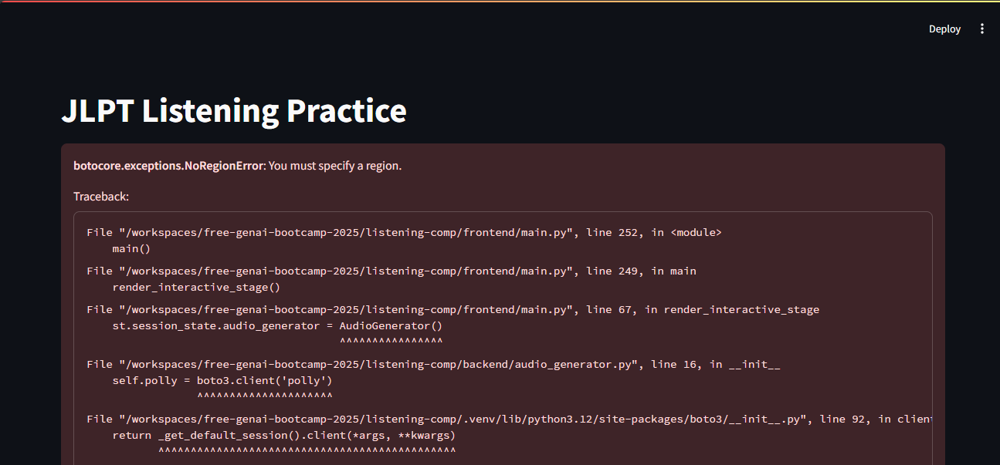

In trying to make this base repo working to later modify it for my specific
purpose I hit a wall when I had to workout all the dependencies from AWS, Azure and GPC so I decided to move on and see if I could make progress with other asigments




## How to run frontend

```sh
streamlit run frontend/main.py
```

## How to run backend

```sh
cd backend
pip install -r requirements.txt
cd ..
python backend/main.py
```